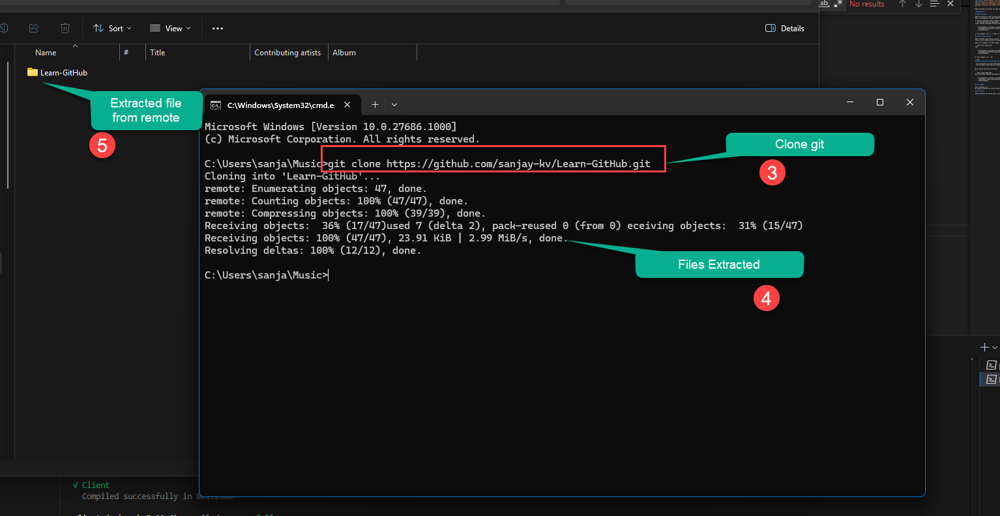

HTML Attributes and Values are used to provide additional information about HTML elements

< />

## HTML Attributes

HTML attributes are used to provide additional information about HTML elements. 
Here is an example of an HTML element with attributes:

Go to this repository https://github.com/sanjay-kv/Learn-GitHub
```html title="CLone the repository"
https://github.com/sanjay-kv/Learn-GitHub.git
```

    <BrowserWindow url="https://github.com/sanjay-kv/Learn-GitHub" bodyStyle={{padding: 0}}>    
     [](https://github.com/sanjay-kv/Learn-GitHub)
    </BrowserWindow>


In this example, the `<a>` element is an 

## HTML Attribute Values

HTML attribute values define specific settings or properties for attributes. They are assigned to attributes using the `=` sign and enclosed in quotes (`"` or `'`). The value of an attribute can be a string, number, URL, color, or other data types depending on the attribute.

Here is an example of an HTML element with attribute values:

```html title="index.html"
cmd
```

    <BrowserWindow url="https://github.com/sanjay-kv/Learn-GitHub" bodyStyle={{padding: 0}}>    
     [](https://github.com/sanjay-kv/Learn-GitHub)
    </BrowserWindow>


In this example, the ``

:::tip
### Best Practices for Using HTML Attributes and Values

- Use attributes to provide additional information about elements and improve accessibility.
- Use attribute values that are relevant and descriptive to enhance the user experience.


By following these best practices, 
:::

```html title="index.html"
git clone https://github.com/sanjay-kv/Learn-GitHub.git
```

    <BrowserWindow url="https://github.com/sanjay-kv/Learn-GitHub" bodyStyle={{padding: 0}}>    
     [](https://github.com/sanjay-kv/Learn-GitHub)
    </BrowserWindow>


## For Example

Let's consider an e
By using attributes and values effectively, you can create engaging and informative web pages that provide a rich user experience.

## Conclusion

HTML attributes and values play a crucial role in web development 