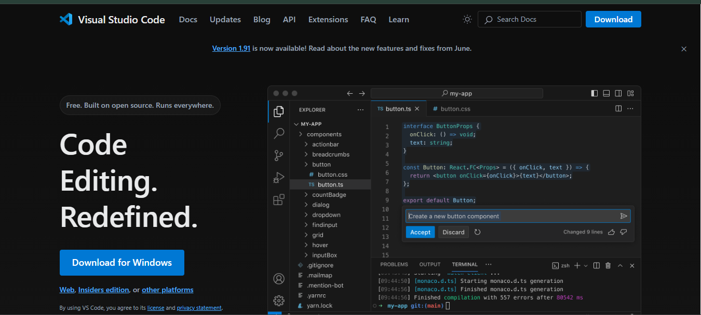
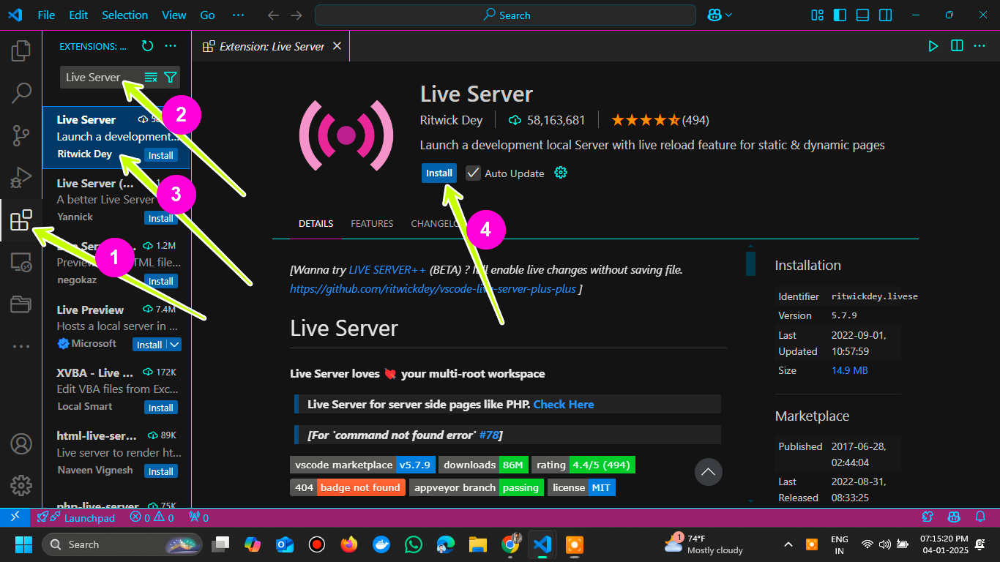
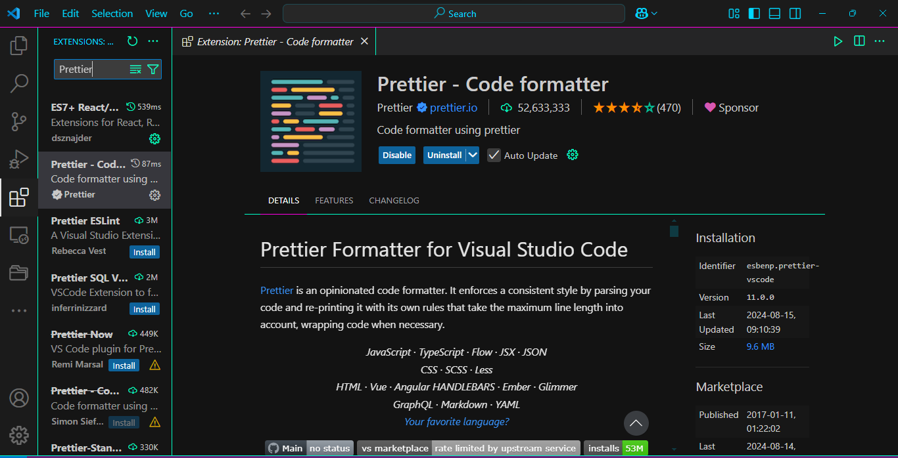

Setting up your development environment is the first step towards becoming a proficient web developer. Whether you're a beginner or an experienced coder, having the right tools can make a significant difference in your productivity and coding experience. In this tutorial, we'll explore the importance of an Integrated Development Environment (IDE) or text editor for HTML coding, compare some of the top IDEs and text editors available, and guide you through setting up your development environment using Visual Studio Code, a popular choice among developers.

<AdsComponent />

## What is an IDE and Why Do You Need One?

An Integrated Development Environment (IDE) is a software application that provides comprehensive facilities to computer programmers for software development. It typically includes a source code editor, build automation tools, and a debugger. IDEs are designed to streamline the coding process by providing features like syntax highlighting, auto-completion, and debugging tools, making it easier for developers to write, test, and debug code.

### Key Features to Look for in an IDE/Text Editor

1. **Syntax Highlighting:** Color-coding of keywords, variables, and strings to make code more readable.
2. **Auto-Completion:** Suggestions for code completion as you type to speed up coding.
3. **Code Formatting:** Automatic formatting of code to maintain consistency and readability.
4. **Debugging Tools:** Built-in tools to help identify and fix errors in your code.
5. **Version Control Integration:** Support for version control systems like Git to track changes.
6. **Extensions and Plugins:** A library of extensions and plugins to customize and extend the functionality of the IDE.
7. **Live Preview:** Real-time preview of your code changes in a web browser for web development.
8. **Customization Options:** Ability to customize the editor's appearance and behavior to suit your preferences.
9. **Cross-Platform Support:** Availability on multiple operating systems for flexibility.
10. **Community Support:** Active community of users and developers for help and resources.
11. **Performance:** Fast and responsive performance to handle large codebases efficiently.
12. **Cost:** Free vs. paid software based on your budget and requirements.
13. **Ease of Use:** Intuitive interface and user-friendly features for a smooth coding experience.
14. **Language Support:** Support for multiple programming languages and frameworks to cater to diverse needs.

<AdsComponent />

## Comparing the Top IDEs and Text Editors

There are many IDEs and text editors available for web development, each with its own set of features and benefits. Here's a comparison of some of the most popular choices:

### 1. Visual Studio Code (VS Code)

- **Features:** Lightweight, powerful, and customizable with a rich extension library.
- **Language Support:** Extensive support for various programming languages and frameworks.
- **Price:** Free and open-source.
- **Platforms:** Windows, macOS, Linux.
- **Community:** Large and active community with plenty of resources and support.
- **Live Preview:** Available through extensions like Live Server.
- **Extensions:** Rich library of extensions for customization and additional features.
- **Debugging:** Built-in debugging tools for Node.js and other languages.
- **IntelliSense:** Intelligent code completion and suggestions.
- **Version Control:** Integrated Git support.
- **Performance:** Fast and responsive performance.
- **Customization:** Highly customizable with themes and settings.
- **Ease of Use:** Intuitive interface and user-friendly features.
- **Recommended For:** Beginners and experienced developers looking for a versatile and powerful editor.
- **Website:** [Visual Studio Code](https://code.visualstudio.com/)
- **Download:** [Download VS Code](https://code.visualstudio.com/Download)

### 2. Sublime Text

- **Features:** Fast, lightweight, and customizable with a distraction-free mode.
- **Language Support:** Extensive language support with syntax highlighting and auto-completion.
- **Price:** Free trial with a one-time purchase for a license.
- **Platforms:** Windows, macOS, Linux.
- **Community:** Active community with a variety of plugins and resources.
- **Live Preview:** Available through plugins like LiveReload.
- **Extensions:** Rich library of plugins for additional features.
- **Debugging:** Requires third-party packages for debugging.
- **IntelliSense:** Limited auto-completion compared to VS Code.
- **Version Control:** Requires plugins for Git integration.
- **Performance:** Fast and responsive performance.
- **Customization:** Highly customizable with themes and settings.
- **Ease of Use:** Intuitive interface with a minimalistic design.
- **Recommended For:** Developers looking for a fast and customizable editor with a focus on simplicity.
- **Website:** [Sublime Text](https://www.sublimetext.com/)
- **Download:** [Download Sublime Text](https://www.sublimetext.com/download)
- **Pricing:** $80 for a single-user license.
- **Free Trial:** Unlimited evaluation period with occasional pop-up reminders.

### 3. Atom

- **Features:** Customizable, hackable, and open-source with a modern interface.
- **Language Support:** Extensive language support with syntax highlighting and auto-completion.
- **Price:** Free and open-source.
- **Platforms:** Windows, macOS, Linux.
- **Community:** Active community with a variety of packages and themes.
- **Live Preview:** Available through packages like atom-live-server.
- **Extensions:** Rich library of packages for additional features.
- **Debugging:** Requires third-party packages for debugging.
- **IntelliSense:** Limited auto-completion compared to VS Code.
- **Version Control:** Requires packages for Git integration.
- **Performance:** Slower performance compared to VS Code.
- **Customization:** Highly customizable with themes and settings.
- **Ease of Use:** Intuitive interface with a modern design.
- **Recommended For:** Developers looking for a customizable and extensible editor with a modern interface.
- **Website:** [Atom](https://atom.io/)
- **Pricing:** Free and open-source.
- **GitHub Integration:** Developed by GitHub and integrates with GitHub repositories.

### 4. Notepad++

- **Features:** Lightweight, fast, and simple with syntax highlighting.
- **Language Support:** Basic language support with syntax highlighting.
- **Price:** Free and open-source.
- **Platforms:** Windows.
- **Community:** Limited community support compared to other editors.
- **Live Preview:** Not available.
- **Extensions:** Limited extensibility compared to other editors.
- **Debugging:** Not available.
- **IntelliSense:** Basic auto-completion for keywords.
- **Version Control:** Requires external tools for version control.
- **Performance:** Fast and responsive performance.
- **Customization:** Limited customization options.
- **Ease of Use:** Simple interface with basic features.
- **Recommended For:** Beginners and users looking for a lightweight and simple editor.
- **Website:** [Notepad++](https://notepad-plus-plus.org/)
- **Pricing:** Free and open-source.
- **Platforms:** Windows only.

### 5. Brackets

- **Features:** Lightweight, open-source, and focused on web development.
- **Language Support:** Extensive language support with live preview and preprocessor support.
- **Price:** Free and open-source.
- **Platforms:** Windows, macOS, Linux.
- **Community:** Active community with a variety of extensions and themes.
- **Live Preview:** Built-in live preview feature for web development.
- **Extensions:** Rich library of extensions for additional features.
- **Debugging:** Requires third-party extensions for debugging.
- **IntelliSense:** Limited auto-completion compared to VS Code.
- **Version Control:** Requires extensions for Git integration.
- **Performance:** Fast and responsive performance.
- **Customization:** Limited customization options compared to other editors.
- **Ease of Use:** Intuitive interface with a focus on web development.
- **Recommended For:** Web developers looking for a lightweight editor with live preview features.
- **Website:** [Brackets](http://brackets.io/)
- **Pricing:** Free and open-source.
- **Live Preview:** Built-in live preview feature for web development.
- **Preprocessor Support:** Support for preprocessors like LESS and SCSS.

### other IDEs and Text Editors

- **WebStorm:** A powerful IDE for web development by JetBrains with advanced features.
- **Eclipse:** An open-source IDE for Java development with support for other languages.
- **NetBeans:** An open-source IDE for Java development with support for web technologies.
- **PHPStorm:** A PHP-focused IDE by JetBrains with advanced features for PHP development.
- **Vim:** A highly customizable text editor with a steep learning curve but powerful features.
- **Emacs:** An extensible text editor with a steep learning curve but powerful features.
- **Notepad:** A simple text editor built into Windows for basic text editing tasks.
- **TextMate:** A lightweight text editor for macOS with a focus on simplicity and ease of use.

When choosing an IDE or text editor for HTML development, consider your workflow, requirements, and preferences. Each editor has its strengths and weaknesses, so it's essential to find the one that best suits your needs and coding style.

<AdsComponent />

## Setting Up Your Development Environment

Let’s set up a development environment using Visual Studio Code, a favorite among many developers due to its power and flexibility.

### Step 1: Download and Install VS Code

1. Go to the [Visual Studio Code website](https://code.visualstudio.com/).

    <BrowserWindow url="https://code.visualstudio.com/" bodyStyle={{padding: 0}}>    
     [](https://code.visualstudio.com/)
    </BrowserWindow>

2. Download the version appropriate for your operating system.
3. Install the software by following the on-screen instructions.

### Step 2: Customize Your Editor

1. Install Extensions:

   - Open VS Code.
   - Go to the Extensions view by clicking the Extensions icon in the Activity Bar on the side or pressing Ctrl+Shift+X.
   - Search for and install useful extensions like:
     - **Live Server:** Launch a local development server with live reload feature.
          
          

     - **Prettier:** Code formatter to maintain consistent code style.
          
          
          
  
2. Customize Settings:
   
   - Go to `File` &rarr; `Preferences` &rarr; `Settings` or press `Ctrl+,`.
   - Customize your settings, themes, and keybindings to suit your preferences.
   - Explore the available options to personalize your coding environment.

<AdsComponent />

### Step 3: Start Coding

1. Create a new file by clicking `File` &rarr; `New File`.
2. Save it with a `.html` extension (e.g., `index.html`).
3. Write your HTML code. For example:

```html title="index.html"
<!DOCTYPE html>
<html lang="en">
  <head>
    <meta charset="UTF-8" />
    <meta name="viewport" content="width=device-width, initial-scale=1.0" />
    <title>My First HTML Page</title>
  </head>
  <body>
    <h1>Hello, World!</h1>
    <p>This is my first HTML page using VS Code.</p>
  </body>
</html>
```

4. To see your work in action, right-click on the index.html file and select "Open with Live Server". Your default web browser should open and display your HTML page. `http://localhost:5500/index.html` will be the URL.

   <BrowserWindow url="http://localhost:5500/index.html">
    <>
      <h1>Hello, World!</h1>
      <p>This is my first HTML page using VS Code.</p>
    </>
   </BrowserWindow>
   
5. Make changes to your code and see the live preview update automatically.

Congratulations! You've successfully set up your development environment using Visual Studio Code and created your first HTML page. You're now ready to start coding and building amazing web projects.

<AdsComponent />

## Conclusion

Setting up your development environment is a crucial step in your journey as a web developer. By choosing the right IDE or text editor and customizing it to suit your needs, you can enhance your coding experience and productivity. Visual Studio Code is a popular choice among developers due to its versatility, powerful features, and active community support. By following the steps outlined in this tutorial, you can set up your development environment using VS Code and start coding HTML like a pro.