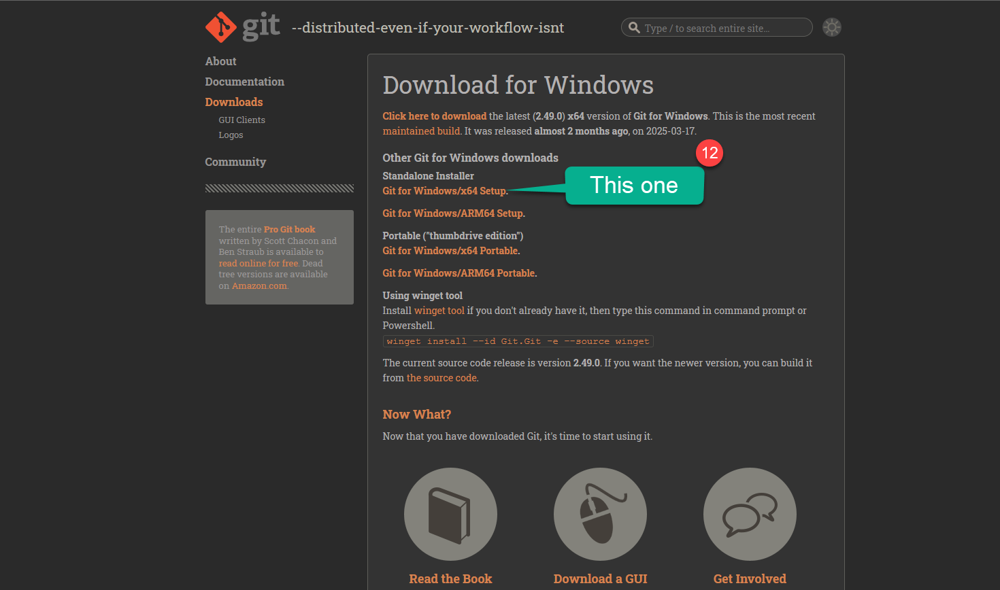

Github is a way of version control your software development using Git, Github was founded in 2008 and recently Microsoft has bought the company now Microsoft is the parent organization of Github. Now setting up is very straight forward process , first you need to create a GitHub account online, then Install Git in your system and connect your Git with GitHub. So all the changes will be updated to the GitHub. 

<AdsComponent />
### Installing Git on Mac

There are four ways we can install Github on mac

1. Install Via Homebrew
2. Xcode Approach
3. Binary Installer
4. Building from source
   
Here in this post, we will be using homebrew to install, Go to the homebrew website, copy the install command, once copied go to the mac terminal copy-paste the code, Mac will ask you to enter the system password, click enter. It may take 2 to 3 minutes to install homebrew

1. Go to the [Git Website](https://brew.sh/) and click on download for windows button.

    <BrowserWindow url="https://brew.sh/" bodyStyle={{padding: 0}}>    
     [](https://git-scm.com/)
    </BrowserWindow>


### Step 2: Select your Version you want to insatll.

1. Once Installed use the below command to check version of the brew on terminal brew -v

Now you can install git on mac system by entering below command on terminal, In future if you want to update the version of git installed on mac or windows use the git clone https://github.com/git/git command on terminal or git bash. 


  ```html title="create a new repository on the command line"
brew install git-gui
    ```

     - **Installer:** Get the Installer
    <BrowserWindow url="https://git-scm.com/downloads/win" bodyStyle={{padding: 0}}>    
     [](https://git-scm.com/downloads/win)
    </BrowserWindow>
        

<AdsComponent />

## Conclusion

In conclusion, I hope you enjoyed reading this article on “Setting up your Git Enviornment?”. In the next post, will be discussing using Git to create a Repository and clone a project Github.  Signing off Sanjay Viswanathan.